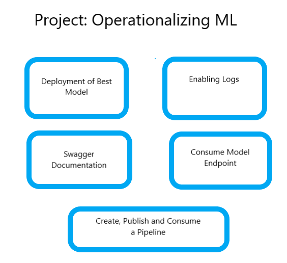

# Secure ML Model Deployment on Microsoft Azure

This covers some of the general aspects of a secure state of the art deployment and hence publishing of models on Micrsoft Azure. It covers in short the securing of a workspace, to one form of model deployment, and futhermore to another form of model publishing. I have created a screencast which will elucidate matters further.   

## Architectural Diagram
 

## Key Steps

### Step 1 Deployment of best Model
We authenticate to secure system. Then manually make a AutoML run with our registered dataset from ML Studio. We then deploy the best model.

### Step 2 Enabling Logs
The deployed model has an endpoint, which can now interact with rest of the internet. To monitor the interaction enable logs.

### Step 3 Swagger Documentation
In order to monitor how the model interact with the internet the deployed model is fitted with swagger docs. They help one see how "the method" the model receives data and what the possible outputs are "the responses". 

### Step 4 Consume Model Endpoint
Now we interact with the deployed model with so native scripts in bash. The output of this interaction is a Json.

### Step 5 Create, Publish and Consume a Pipeline
Now we look into creating a pipeline all the way till its consumption.

## Screen Recording
link to a screen recording of the project in action: https://youtu.be/m8A1JtrmEe8
