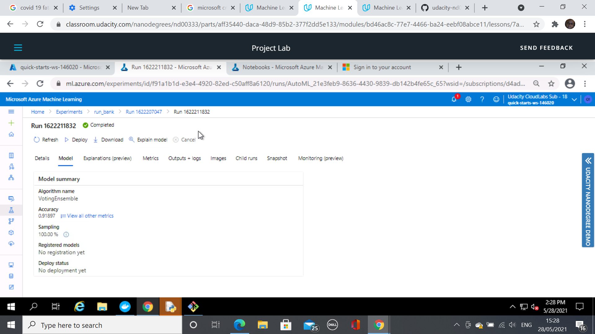
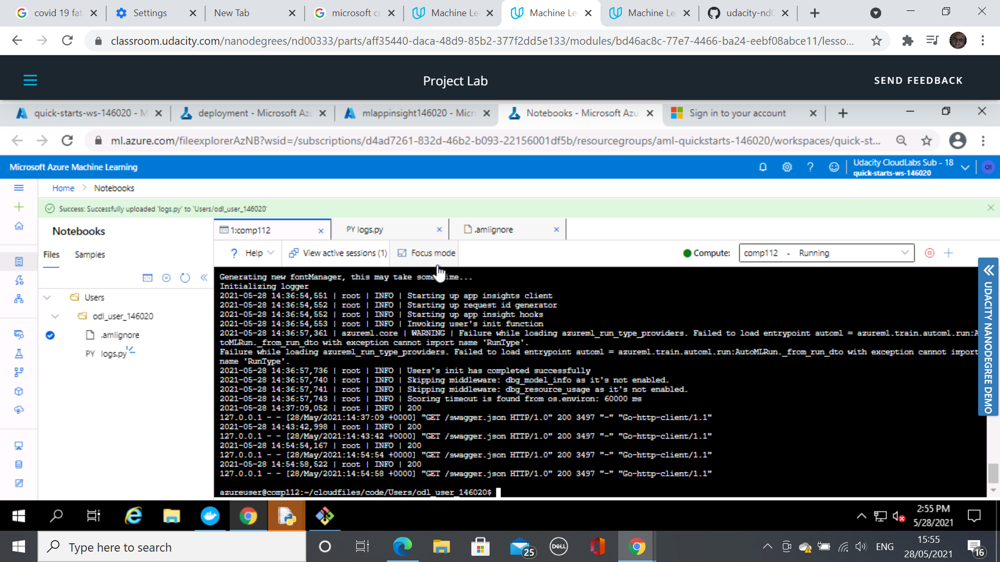
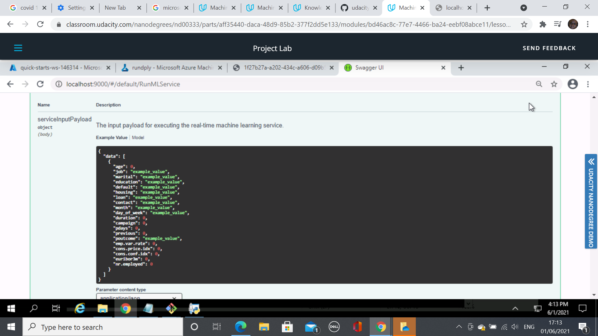
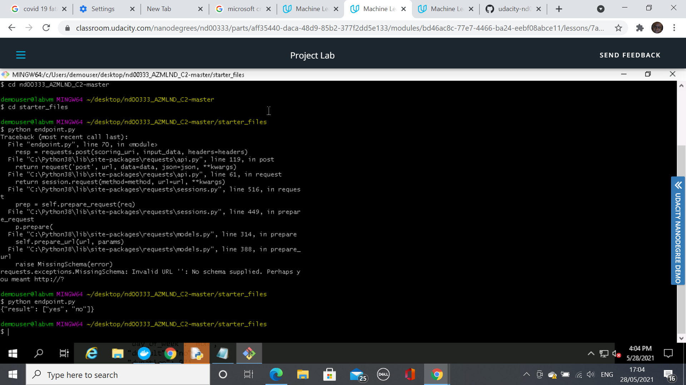
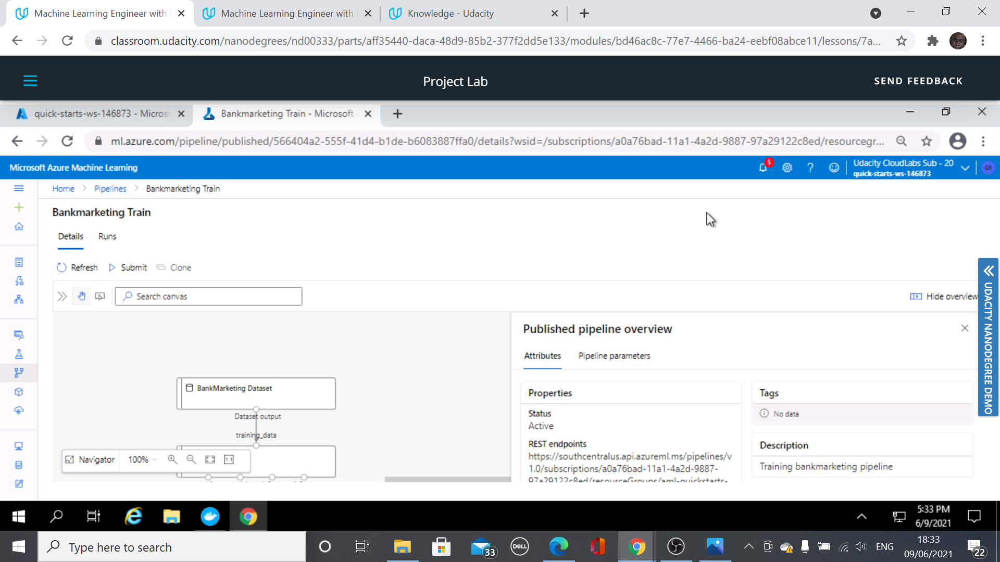

*NOTE:* This file is a template that you can use to create the README for your project. The *TODO* comments below will highlight the information you should be sure to include.

# Secure ML Model Deployment on Microsoft Azure

This covers some of the general aspects of a secure state of the art deployment and hence publishing of models on Micrsoft Azure. It covers in short the securing of a workspace, to one form of model deployment, and futhermore to another form of model publishing.  

## Architectural Diagram
*TODO*: Provide an architectual diagram of the project and give an introduction of each step. An architectural diagram is an image that helps visualize the flow of operations from start to finish. In this case, it has to be related to the completed project, with its various stages that are critical to the overall flow. For example, one stage for managing models could be "using Automated ML to determine the best model". 

## Key Steps
*TODO*: Write a short discription of the key steps. Remeber to include all the screenshots required to demonstrate key steps.

## Screen Recording
link to a screen recording of the project in action: https://youtu.be/m8A1JtrmEe8

## Standout Suggestions
*TODO (Optional):* This is where you can provide information about any standout suggestions that you have attempted.
